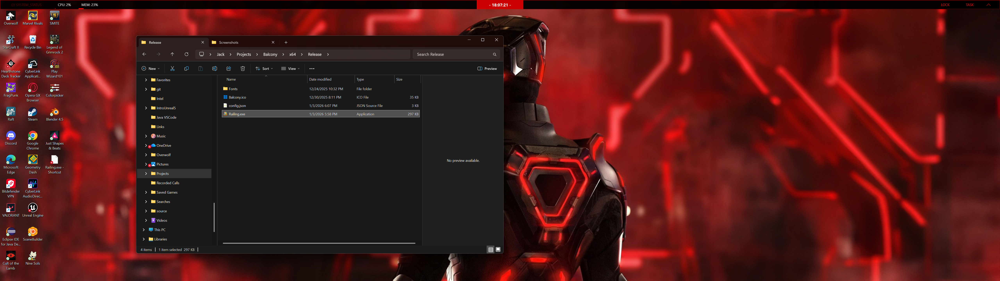

# Railing

   

**Railing** is a hyper-efficient, native C++ desktop shell for Windows.

Designed as a "Glass Box" alternative to the standard Windows taskbar, it prioritizes absolute performance and transparency. Unlike modern widgets built on heavy web technologies (Electron, WebView2), Railing is built directly on the **Win32 API** and **Direct2D**. It renders at high framerates with near-zero resource usage, offering true acrylic blur, real-time hardware telemetry, and pixel-perfect customization.

## Features

* **⚡ Native Performance:** Written purely in C++. No web engines, no interpretation, no bloat.
* **💎 True Glass:** Implements undocumented Windows 10/11 APIs for genuine, high-performance acrylic blur behind the bar.
* **📊 Hardware Telemetry:**
    * **GPU:** Real-time temperature monitoring via `DXCore` (supports dedicated NVIDIA/AMD cards).
    * **CPU & RAM:** Accurate load usage via Windows Performance Counters.
* **🖥️ Workspaces:** Seamless virtual desktop switching and visualization.
* **🎨 JSON Theming:** Every pixel—margins, border widths, colors, fonts, and layouts—is scriptable via `config.json`.
* **🧩 Modular Architecture:**
    * System Tray & Notification Area
    * Volume Control (with native flyouts)
    * Network & Battery Status
    * Clock (with custom strftime formatting)

## Presets

Railing includes several built-in themes to get you started. You can find these configuration files in the `presets/` directory.

---

### Neon Cyberpunk  
High contrast, retrowave aesthetic.

<a href="screenshots/neon_cyberpunk.png">
  
</a>

**Source:** [`neon_cyberpunk.json`](presets/neon_cyberpunk.json)

---

### Nordic Minimal  
Matte colors, rounded corners, clean look.

<a href="screenshots/nordic_minimal.png">
  
</a>

**Source:** [`nordic_minimal.json`](presets/nordic_minimal.json)

---

### Glass Pill  
Windows 11 style, heavy blur, floating modules.

<a href="screenshots/glass_pill.png">
  
</a>

**Source:** [`glass_pill.json`](presets/glass_pill.json)

---

### Red Alert  
High-density, server-monitor style.

<a href="screenshots/red_alert.png">
  
</a>

**Source:** [`red_alert.json`](presets/red_alert.json)


## Directory Structure

This repository is structured as a **Balcony** solution containing the **Railing** project.

* `Balcony.slnx` - The main Visual Studio Solution file.
* `Railing/` - Source code for the main bar application.
* `presets/` - Pre-made JSON configuration themes.

## Build Instructions

### Prerequisites
* Windows 10 (1903+) or Windows 11.
* **Visual Studio 2022** with "Desktop development with C++" workload installed.
* **Windows SDK** (10.0.19041.0 or newer).

### Steps
1.  **Clone the repository:**
    ```powershell
    git clone [https://github.com/YourUsername/Balcony.git](https://github.com/YourUsername/Balcony.git)
    cd Balcony
    ```
2.  Open `Balcony.slnx` in Visual Studio 2022.
3.  Set the build configuration to **Release / x64**.
4.  Right-click the **Railing** project in the Solution Explorer and select **Set as Startup Project**.
5.  **Build Solution** (`Ctrl+Shift+B`).
6.  The executable will be located in `x64/Release/Railing.exe`.

> **Important:** The application requires a `config.json` file in the same directory as the `.exe` to run. Copy one from the `presets/` folder or create your own.

## Configuration

Railing is configured via `config.json`. The file is split into three main sections:

### 1. Global
Controls the window properties, positioning, and global aesthetic.
```json
"global": {
  "position": "top",          // "top", "bottom", "left", "right"
  "height": 44,               // Bar thickness
  "blur": true,               // Enable Windows Acrylic blur
  "background": "#101018cc",  // Hex color (#RRGGBBAA)
  "font": "Segoe UI Variable Display"
}
```
### 2. Layout
Determines the order of modules.

```json
"layout": {
  "left": ["workspaces"],
  "center": ["clock"],
  "right": ["cpu", "gpu", "ram", "group_hardware"]
}
```
### 3. Modules
Defines the behavior and style of specific widgets.

```json
"gpu": {
  "type": "gpu",
  "format": "GPU {temp}\u00B0C", // Use \u00B0 for degree symbol
  "interval": 2000,              // Update every 2 seconds
  "style": {
    "bg": "#000000",
    "fg": "#00ff00",
    "border_width": 1,
    "border_color": "#00ff00"
  },
  "thresholds": [
    { "val": 80, "style": { "fg": "#ff0000" } } // Red text if temp > 80C
  ]
}
```
## Troubleshooting
**Q: My GPU module shows "0°C".** A: Railing attempts to find a Dedicated GPU via `DXCore`. Ensure you are running on a system with a dedicated GPU drivers installed. Integrated graphics (iGPU) often do not report temperature via standard driver paths.

**Q: Text looks weird or characters are broken.** A: Ensure your JSON file uses Unicode Escape Sequences for special characters (e.g., use `\u00B0` instead of `°`).

## License
This project is licensed under the GNU General Public License v3.0 - see the LICENSE file for details.
